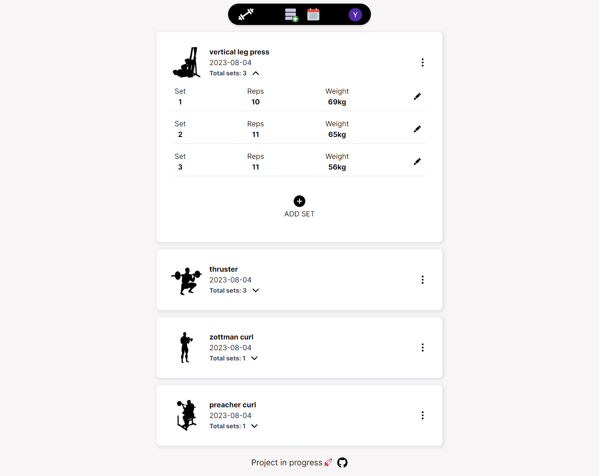

Project still in progress 

demo: https://gym-planner-app.netlify.app/

## Features
1. User Authentication: Users can sign in using Google or as a guest.
2. Workout Customization: Users can select their desired muscle group and exercise, and add them to their workout card.
3. Workout Management: Users have the ability to add and edit the number of sets, reps, and weight for each exercise in their workout card.
4. Workout Planning: The application includes a calendar feature to help users effectively plan their workouts.
5. Data Persistence: The workout cards are saved to a Firestore db, enabling users to keep track of their workouts across multiple sessions.

## TOOLS USED:
- React
- Next.js
- Typescript
- Tailwind (styling)
- Firebase for database and auth.

